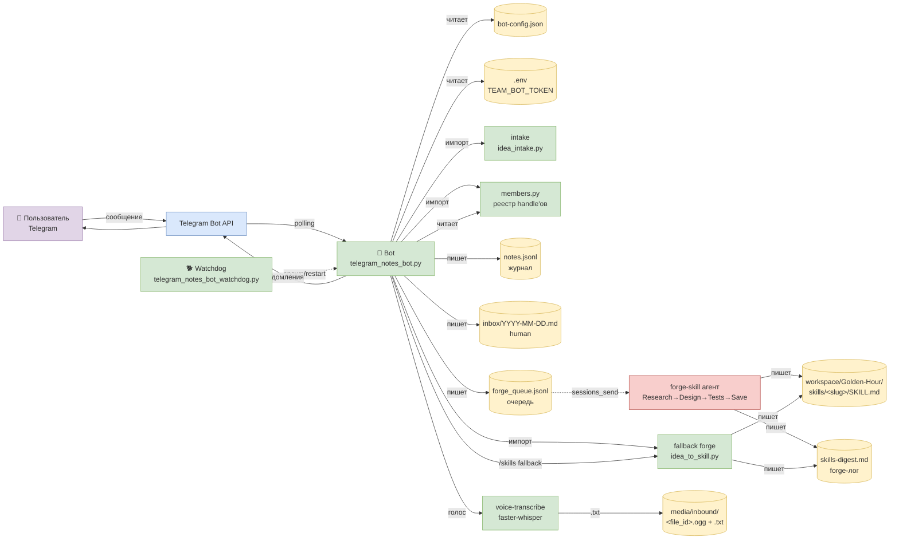
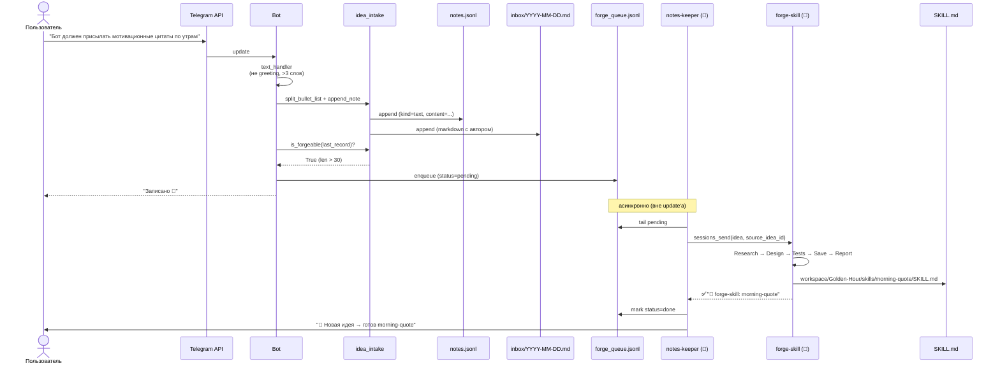
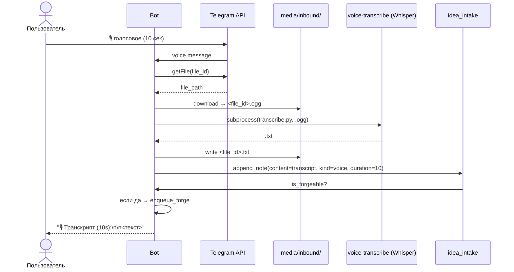
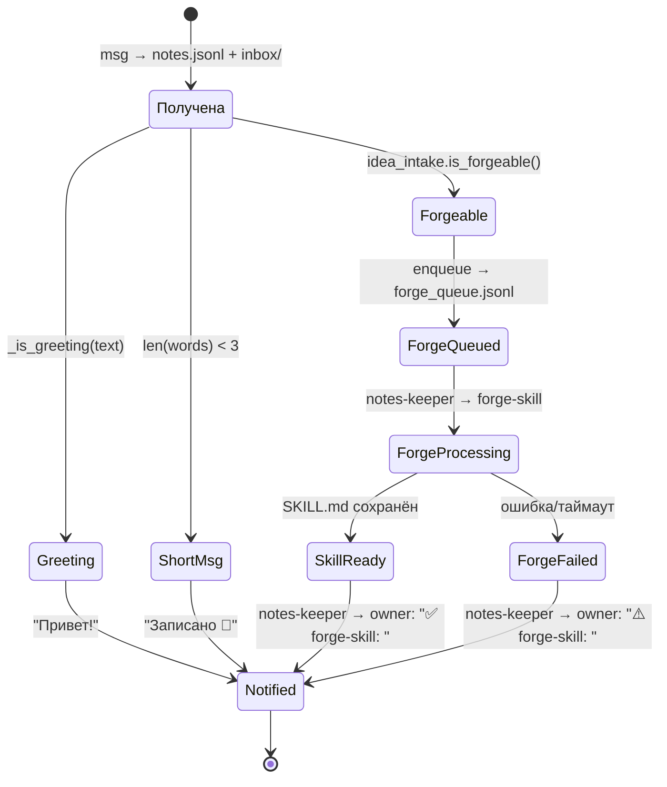
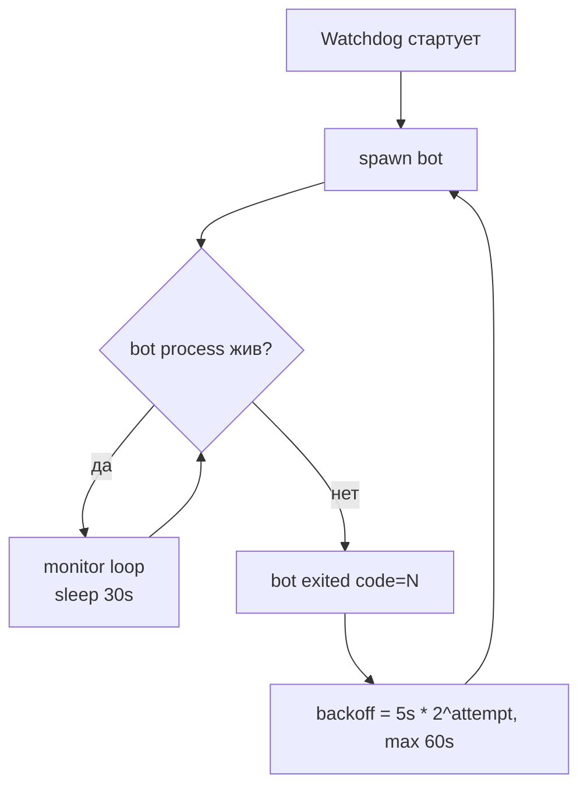

# ARCHITECTURE — Notes-Bot Kit

> Полная развертка. Документ описывает production-систему (Karim's @Goldenteam239bot), 1:1 совпадающую с runtime/ в этом пакете. Обновляется при изменениях в коде или конфиге.

## Содержание

1. [System overview](#1-system-overview)
2. [Subsystems](#2-subsystems)
3. [Happy path — нормальная идея](#3-happy-path--нормальная-идея)
4. [Forge-пайплайн — от сообщения до SKILL.md](#4-forge-пайплайн--от-сообщения-до-skillmd)
5. [Голосовой пайплайн (опционально)](#5-голосовой-пайплайн-опционально)
6. [State machine — жизненный цикл идеи](#6-state-machine--жизненный-цикл-идеи)
7. [Permissions / RBAC](#7-permissions--rbac)
8. [Хранилище](#8-хранилище)
9. [Watchdog ↔ Bot](#9-watchdog--bot)
10. [Известные баги и их фиксы](#10-известные-баги-и-их-фиксы)

---

## 1. System overview



**Читать слева направо:** пользователь шлёт сообщение → Telegram API → бот (polling) → intake классифицирует → запись в `notes.jsonl` + `inbox/`. Если forgeable — тихо в `forge_queue.jsonl` (notes-keeper потом дёрнет `forge-skill`). Голосовые — через `voice-transcribe` skill (Whisper) → текст → тот же intake. Watchdog отдельно следит, чтобы бот не упал.

---

## 2. Subsystems

| Подсистема | Файл | Назначение |
|---|---|---|
| **Bot core** | `runtime/scripts/telegram_notes_bot.py` | aiogram 3.x, polling, все хендлеры, команды, периодический digest |
| **Watchdog** | `runtime/scripts/telegram_notes_bot_watchdog.py` | Spawns bot в loop, экспоненциальный backoff 5→60 сек при крэшах |
| **Intake / Classifier** | `runtime/scripts/idea_intake.py` | Дедуп, стоп-слова, классификация идей, split на под-идеи, is_forgeable() |
| **Local forge fallback** | `runtime/scripts/idea_to_skill.py` | Локальная генерация SKILL.md для `/skills` (без research/тестов) |
| **Members registry** | `runtime/scripts/members.py` | Резолв user_id → handle/name через `memory/members.json` |
| **Forge-check util** | `runtime/scripts/forge_check.py` | Одноразовая утилита для дебага forgeable (не критичный) |

---

## 3. Happy path — нормальная идея



**Ключевые гарантии:**

- **Один update → одна запись в `notes.jsonl` → максимум одна запись в `forge_queue.jsonl`.**
- **Бот НЕ ждёт forge-skill.** Forge-обработка полностью асинхронна (notes-keeper дёргает forge-skill отдельно).
- **Бот НЕ спамит Karim'а уведомлениями о forge.** Только финальный отчёт от notes-keeper после готовности.

---

## 4. Forge-пайплайн — от сообщения до SKILL.md

### 4.1. Триггер: бот ставит в очередь

В `telegram_notes_bot.py → _maybe_auto_skill_from_text`:

```python
async def _maybe_auto_skill_from_text(message: Message) -> None:
    if not _auto_skill_enabled():   # bot-config.json → auto_skill_from_ideas
        return
    if not is_owner(message.from_user):
        return

    # Найти ПОСЛЕДНЮЮ запись этого user_id в notes.jsonl
    user_id = message.from_user.id
    last_record = ...  # walk reversed

    content = last_record["content"]
    if not idea_intake.is_forgeable(last_record):  # len > 30 + не greeting
        return

    _enqueue_forge(last_record, content)  # пишем в forge_queue.jsonl
```

### 4.2. Очередь: `memory/forge_queue.jsonl`

Каждая строка — JSON:
```json
{
  "queued_at": "2026-06-23T14:30:00+03:00",
  "source": "ts=2026-06-23T14:30:00 user_id=1038917447",
  "chat_id": 1038917447,
  "username": "beatusx",
  "content": "Бот должен присылать мотивационные цитаты по утрам",
  "ts": "2026-06-23T14:30:00+03:00",
  "status": "pending",
  "result_summary": null,
  "processed_at": null
}
```

### 4.3. Обработчик: notes-keeper

`notes-keeper` агент (📓) периодически (или по триггеру «обработай forge_queue») берёт `pending` строки и дёргает `forge-skill` через `sessions_send`:

```
sessions_send(
  agentId="forge-skill",
  message="idea: Бот должен присылать мотивационные цитаты по утрам | source_idea_id: ts=2026-06-23T14:30:00 user_id=1038917447"
)
```

### 4.4. forge-skill: 5 шагов за ≤ 5 мин

```
1. Research      ← web_search + web_fetch топ-3-5 источников
2. Design        ← SKILL.md по шаблону (frontmatter + 7 секций)
3. Tests         ← pytest до зелёного
4. Save          ← workspace/Golden-Hour/skills/<slug>/
5. Report        ← вернуть отчёт инициатору через sessions_send
```

### 4.5. Шаблон SKILL.md

Frontmatter (обязательно):
```yaml
---
name: <slug>
description: "<≤160 байт, что делает + эмодзи>"
---
```

Секции (обязательно все 7):
1. **Цель** — зачем этот скилл
2. **Триггер** — когда и как вызывается (расписание / команда / событие)
3. **Логика** — пошаговый алгоритм
4. **Вход → Выход** — таблица типов и описаний
5. **Примеры** — doctest + пользовательский вид
6. **Что НЕ делает** — границы
7. **Зависимости** — от чего зависит

Структура папки:
```
workspace/Golden-Hour/skills/<slug>/
├── SKILL.md
├── proposal.json     ← метаданные (slug, source_idea_id, tags, status)
├── assets/           ← (опционально)
├── examples/         ← (опционально)
└── tests/
    ├── __init__.py
    └── test_smoke.py ← pytest, минимум проверок frontmatter
```

### 4.6. Локальный fallback (`/skills`)

Если `forge-skill` агент недоступен, команда `/skills` запускает `idea_to_skill.run_pipeline(scope)` — локальный генератор без research и тестов. Это даёт базовый SKILL.md, который потом можно доработать руками или отдать в forge-skill на полировку.

---

## 5. Голосовой пайплайн (опционально)

### 5.1. Включение

`bot-config.json → asr.server_side: true` + установленный `faster-whisper` + `ffmpeg` в PATH.

### 5.2. Поток



### 5.3. Если Whisper недоступен

Бот не падает. Пишет:
```
Записано 🎙 (10s) — без транскрипта (Whisper недоступен)
```
И кладёт placeholder: `(голосовое 10s, без транскрипта)`. Intake его отсеет как `media_no_caption`.

---

## 6. State machine — жизненный цикл идеи



### Rejected ветка (отсев)

Параллельно intake классифицирует "мусор" и кладёт в `memory/ideas_rejected.md`:
- `command` — `/info`, `/start`, etc.
- `test_input` — `ппп`, `тест`, `аааа`
- `media_no_caption` — фото без подписи
- `empty` — пустой content
- `duplicate` — то же самое в течение 30 мин
- `manual` — помечены `is_idea=false` руками

Смотреть через `/rejected [category]` или `/rejected` (сводка).

---

## 7. Permissions / RBAC

| Роль | Кто | Что доступно |
|---|---|---|
| **Owner** | Один человек, указан в `bot-config.json → owner.username` | ВСЕ команды + `/start` (регистрация chat_id) + авто-forge |
| **Team** | Telegram usernames в `bot-config.json → team` | Read: `/info`, `/ideas`, `/skills`, `/rejected`, `/split`, `/classify` |
| **Guest** | Все остальные | Только отправка сообщений (текст/голос/фото). Ответ "Принято ✅". Нет команд. |

Определение роли в `telegram_notes_bot.py`:
```python
def is_owner(user):     # username match (case-insensitive)
def is_team_member(user): # owner OR username in team
```

Гостевые сообщения **всё равно записываются** в `notes.jsonl` + `inbox/` — это by design, чтобы не терять сигнал от людей за пределами команды.

---

## 8. Хранилище

### 8.1. Файлы

| Путь | Тип | Что внутри |
|---|---|---|
| `memory/notes.jsonl` | append-only | ВСЕ сообщения (text/voice/photo/document/other). Бот пишет, intake читает |
| `memory/inbox/YYYY-MM-DD.md` | append-only | Human-readable дневной дамп: время, автор, тип, контент |
| `memory/forge_queue.jsonl` | append + status | Forgeable-идеи, ожидающие forge-skill |
| `memory/forge_results.jsonl` | append | Результаты forge-skill (успех/фейл + summary) |
| `memory/ideas.md` | overwrite | Вывод `/classify` (human-readable, только хорошие идеи) |
| `memory/ideas_rejected.md` | overwrite | Отсеянные (human-readable, по категориям) |
| `memory/ideas_state.json` | JSON | last_run_ts, seen для intake |
| `memory/skills-digest.md` | append | Лог forge-операций (slug, summary, ts) |
| `memory/bot-config.json` | JSON (overwrite) | Конфиг бота |
| `memory/members.json` | JSON (manual) | Реестр user_id → handle |
| `media/inbound/<file_id>.ogg` | file | Голосовые от Telegram |
| `media/inbound/<file_id>.txt` | file | Транскрипт от Whisper |

### 8.2. Схема `notes.jsonl`

```json
{
  "ts": "2026-06-23T14:30:00+03:00",   // ISO с timezone
  "date": "2026-06-23",                // YYYY-MM-DD
  "time": "14:30",                      // HH:MM
  "user_id": 1038917447,
  "username": "beatusx",
  "first_name": "Beatus",
  "last_name": null,
  "kind": "text",                       // text|voice|photo|document|sticker|video|other
  "duration": null,                     // только для voice (в секундах)
  "content": "...",
  "_optional": {
    "is_idea": false,                   // intake проставляет после классификации
    "topic": "...",                     // категория (если проставлена)
    "summary": "...",                   // короткое описание
    "importance": 0,                    // 0-5
    "tags": [],
    "id": "abc123"                      // 10-символьный hash
  }
}
```

### 8.3. Схема `bot-config.json`

См. `runtime/workspace/memory/bot-config.template.json`. Все поля документированы inline-комментариями (в шаблоне).

Ключевые поля:
- `owner.username` — обязательно, иначе бот не узнает владельца
- `auto_skill_from_ideas` — bool, по умолчанию true (включает автопостановку в forge_queue)
- `digest.interval_hours` — период периодической рассылки (по умолчанию 3)
- `asr.server_side` — bool, true = включает Whisper-пайплайн

---

## 9. Watchdog ↔ Bot



**Логика watchdog:**

- Запускает `telegram_notes_bot.py` через `subprocess.call([sys.executable, BOT])`.
- Если процесс упал — `time.sleep(backoff)` и снова spawn.
- Backoff: 5s → 10s → 20s → 40s → 60s (cap). После успешного старта — сброс на 5s.
- Никогда не сдаётся. Точка.
- Лог: `telegram_notes_bot.watchdog.log` рядом со скриптом.
- На `KeyboardInterrupt` (Ctrl+C) — корректно завершается.

**Регистрация в автозапуске (через install.ps1):**

Создаётся Scheduled Task `NotesBotKitWatchdog`:
- **Trigger:** AtLogOn (при логине пользователя)
- **Action:** `python <kit>/scripts/telegram_notes_bot_watchdog.py`
- **Settings:** `RestartCount=99, RestartInterval=1min` — если процесс умер, Windows перезапустит задачу
- **Principal:** Interactive, RunLevel=Highest (чтобы иметь доступ к диску/сети)

---

## 10. Известные баги и их фиксы

### Bug #1 (фикс от 2026-06-21) — «привет» → 16 уведомлений

**Симптом:** на любое короткое сообщение бот Karim'у присылал 16+ уведомлений по всем forgeable-идеям из `notes.jsonl`.

**Root cause:** `_maybe_auto_skill_from_text` сканировал все записи вместо последней, или forge-обработчик обходил все forgeable-идеи заново.

**Фикс (применён в `telegram_notes_bot.py`):**

```python
GREETINGS: set[str] = {
    "привет", "hello", "hi", "хай", "здаров", "здорово", "йоу",
    "test", "тест", "ок", "окей", "ok", "okay",
    "qq", "ага", "угу", "агась", "лл", "ллл",
}
SHORT_MSG_MAX_WORDS = 3

def _is_greeting(text): ...
def _is_short_message(text): ...

async def _handle_text_note(message):
    if _is_greeting(text):     # → "Привет! 👋 Жду идей." (НЕ forge)
        return
    items = idea_intake.split_bullet_list(text) or [text]
    for item in items:
        append_note(user, "text", item)
    if _is_short_message(text): # → записали, но НЕ forge
        return
    await _maybe_auto_skill_from_text(message)  # только для нормальных идей
```

**Backup:** `telegram_notes_bot.py.bak-pre-bug1-fix` (в production; в этом пакете не включён — фикс уже в основном коде).

**Проверка фикса:** написать боту «привет» → 1 ответ, не 16.

---

### Bug #2 (minor) — два инстанса бота одновременно

**Симптом:** иногда watchdog не убивает предыдущий bot-процесс перед spawn нового → два polling'а → конфликт `getUpdates`.

**Workaround:** `Get-Process python | Where ... | Stop-Process` вручную (см. OPERATIONS.md).

**Правильное решение (P2):** watchdog должен сначала убить ВСЕ старые bot-процессы, потом spawn. Не реализовано в v1.

---

### Bug #3 (minor) — race condition: `_handle_other` vs Command-хендлеры

**Симптом:** ~54% rejected = "command", потому что `_handle_other` ловит `/info` раньше `Command("info")` хендлера.

**Причина:** порядок регистрации хендлеров + aiogram dispatcher matching.

**Workaround:** intake понимает что это команда и классифицирует как `command` — пользовательский эффект нормальный.

**Правильное решение (P3):** aiogram Router-ы с правильными приоритетами. Не реализовано.

---

## Что НЕ покрыто архитектурой (намеренно)

- ❌ **UI для редактирования заметок** — только через Telegram и ручной edit JSON
- ❌ **Search** — есть только substring в `/search`, без семантики
- ❌ **Tagging** — есть поле `tags` в intake, но UI для расстановки тегов не реализован
- ❌ **Multi-bot** — один процесс на одного бота, нет shared state
- ❌ **High availability** — один watchdog на одной машине, без failover
- ❌ **End-to-end encryption** — Telegram MTProto шифрует, но .env и notes.jsonl лежат plain
