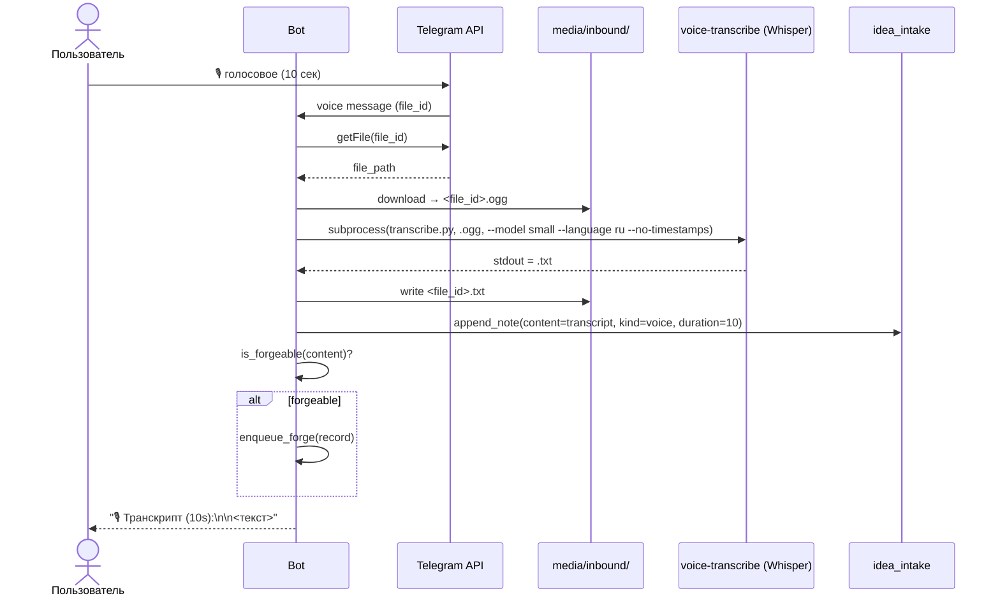

# notes-voice-transcribe

Как Notes-Bot Kit обрабатывает голосовые сообщения: скачивание .ogg из Telegram, транскрипция через faster-whisper (small, ru), сохранение как `kind=voice` в `notes.jsonl`, опциональная постановка в forge-очередь.

## Цель

Дать агенту в OpenClaw полное понимание голосового пайплайна: когда он активен, какие модели используются, что делать если Whisper недоступен, как включить/выключить.

## Триггер

- Вопросы про голосовые сообщения / транскрипцию
- «Почему голосовое не распозналось?»
- Задача включить/выключить серверный ASR
- Дебаг: голосовые не появляются в forge_queue
- Установка/настройка faster-whisper

## Логика

### Когда активен

По умолчанию **выключен** (`bot-config.json → asr.server_side: false`). Включается вручную:

```json
{
  "asr": {
    "server_side": true,
    "client_tool": "wispr_flow",
    "note": "..."
  }
}
```

Клиентский ASR (Wispr Flow на устройстве пользователя) — не наша забота, бот его не видит.

### Поток (когда server_side=true)



### Что внутри voice-transcribe

`skills/voice-transcribe/scripts/transcribe.py` — обёртка над `faster-whisper`:

- Принимает путь к .ogg файлу
- Грузит модель `small` (default), `ru` язык, `no-timestamps`
- Возвращает текст в stdout

**Модели faster-whisper:**
- `tiny` — 75 MB, быстрая, низкое качество
- `base` — 150 MB, баланс
- `small` — 500 MB, хорошее качество (default в боте)
- `medium` — 1.5 GB, лучшее качество
- `large-v3` — 3 GB, максимальное качество

Модель скачивается при первом использовании (кэшируется в `~/.cache/huggingface/`).

### Файлы и пути

| Путь | Что |
|---|---|
| `media/inbound/<file_id>.ogg` | Скачанное голосовое |
| `media/inbound/<file_id>.txt` | Транскрипт |
| `~/.cache/huggingface/` | Кэш моделей Whisper |

### Когда server_side=false (default)

Голосовое всё равно сохраняется:
```
content = "(голосовое 10s, без транскрипта)"
append_note(user, "voice", content, duration=10)
→ intake отсеет как media_no_caption (len < 10)
```

Бот ответит: "Записано 🎙 (10s) — без транскрипта (Whisper недоступен)"

### Конфигурация (в `telegram_notes_bot.py`)

```python
TRANSCRIBE_SCRIPT = WORKSPACE / "skills" / "voice-transcribe" / "scripts" / "transcribe.py"
TRANSCRIBE_PYTHON = r"C:\Users\Admin\AppData\Local\Programs\Python\Python312\python.exe"
TRANSCRIBE_TIMEOUT = 60  # секунд на одно голосовое
MEDIA_DIR = WORKSPACE / "media" / "inbound"
```

`MEDIA_DIR` создаётся автоматически при старте бота.

### Установка voice-transcribe

```powershell
# 1. faster-whisper
python -m pip install faster-whisper

# 2. ffmpeg в PATH (https://www.gyan.dev/ffmpeg/builds/)
$env:Path += ";C:\ffmpeg\bin"

# 3. voice-transcribe skill
# Скопировать из этого пакета: agent-skills/voice-transcribe/ (или из OpenClaw skills)
Copy-Item -Recurse "<kit>\skills\voice-transcribe" "$env:LOCALAPPDATA\NotesBotKit\skills\"

# 4. Включить в bot-config.json
$cfg = Get-Content "$env:LOCALAPPDATA\NotesBotKit\memory\bot-config.json" -Raw | ConvertFrom-Json
$cfg.asr.server_side = $true
$cfg | ConvertTo-Json -Depth 5 | Set-Content "$env:LOCALAPPDATA\NotesBotKit\memory\bot-config.json" -Encoding UTF8

# 5. Рестарт бота
Get-Process python | Where-Object { (Get-CimInstance Win32_Process -Filter "ProcessId=$($_.Id)").CommandLine -match 'telegram_notes_bot\.py' } | Stop-Process -Force
```

### Дебаг

**Голосовое не транскрибируется:**

1. `python -c "import faster_whisper"` — должен пройти без ошибок
2. `ffmpeg -version` — должен показать версию
3. `(Get-Content bot-config.json -Raw | ConvertFrom-Json).asr.server_side` — должно быть `True`
4. `Test-Path "<kit>/skills/voice-transcribe/scripts/transcribe.py"` — должен существовать
5. В логе бота: `voice downloaded: <file_id>.ogg (12345 bytes)` — если нет, проблема скачивания
6. Если есть `transcribe.py rc=<nonzero>` — посмотри stderr

**Долго транскрибирует:**

- Сменить модель на `tiny` или `base` (быстрее, хуже качество)
- Проверить что GPU не используется (CPU-only по умолчанию в faster-whisper)
- Скачать модель заранее (при первом использовании Whisper качает с HuggingFace)

**Транскрипт мусорный:**

- Модель `small` на русском — нормально
- На `tiny` — будет хуже
- На `medium` или `large-v3` — лучше, но медленнее и больше модель
- Проверить язык (`--language ru`)

## Вход → Выход

| Вход | Действие | Выход |
|---|---|---|
| «Включить голос» | Установить faster-whisper + skill + флаг + рестарт | Голосовые транскрибируются |
| «Голос без транскрипта» | Чек 5 пунктов дебага | Решение |
| «Какая модель лучше?» | Рекомендовать `small` (default) или `medium` | Скачанная модель |
| «Где .ogg файлы?» | `<kit>/media/inbound/<file_id>.ogg` | Путь |
| «Сколько голосовых?» | `Get-ChildItem media/inbound/*.ogg \| Measure-Object` | Число |

## Что НЕ делает

- Не запускает Whisper от своего имени для других целей (только для бота)
- Не удаляет .ogg/.txt файлы (хранит на случай ретрая)
- Не делает speaker diarization (не различает говорящих)
- Не делает sentiment analysis (только текст)
- Не переводит на другие языки (только ru)

## Зависимости

| Зависимость | Назначение |
|---|---|
| faster-whisper | ASR-модель (Python pip пакет) |
| ffmpeg | Декодирование .ogg в PCM |
| voice-transcribe skill | Обёртка `transcribe.py` |
| `bot-config.json → asr.server_side=true` | Включение пайплайна |
| ~500 MB-3 GB диска | Кэш моделей Whisper |
| Интернет | Скачивание модели при первом запуске |

## Связанные скиллы

- `notes-bot-architecture` — где голосовой пайплайн в общей картине
- `notes-bot-operator` — как дебажить если не работает
- `notes-idea-intake` — куда идёт транскрибированный текст
- `notes-forge-pipeline` — куда идёт голосовая forgeable идея
