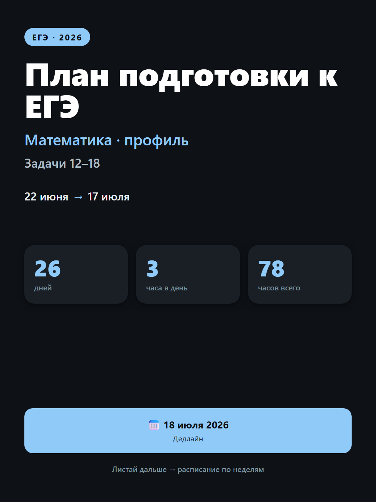

# study-cards

> Рендер мобильных PNG-карточек (1080×1440) для учебных планов и статистики. Кириллица из коробки, light + dark темы, **zero npm-зависимостей**. Только Node.js и локальный Edge/Chrome.

Используется в [OpenClaw](https://github.com/openclaw/openclaw) как визуальный слой для `daily-plan`, `longterm-stats`, `exam-topics`.



---

## Зачем

Карточки удобнее таблиц:
- 1 взгляд = весь план или вся статистика
- Сразу видно где ты сейчас (неделя, день)
- Цветовая кодировка: 🟢 в графике · 🟡 под риском · 🔥 просрочено
- Делиться в Telegram / Discord / WhatsApp альбомом (≤ 10 шт.)

---

## Возможности

| Режим | Что рисует | Источник |
|---|---|---|
| **План** | cover + карточка на каждую неделю | `plan.json` |
| **Статистика** | общая сводка + дедлайны + категории | `tasks.yaml` |
| **Темы** | light, dark (или обе сразу) | — |
| **Язык** | любой Unicode (HTML рендерится Edge) | — |

---

## Установка

```bash
git clone https://github.com/<you>/study-cards.git
cd study-cards
```

**Требования:**
- Node.js **14+** (только stdlib, ничего не ставим)
- **Microsoft Edge** (Windows) или **Google Chrome** (Linux/macOS)
  - Edge по умолчанию: `C:\Program Files (x86)\Microsoft\Edge\Application\msedge.exe`
  - Переопределить: переменная `EDGE_BIN=/path/to/chrome`

---

## Использование

### 1. План (`plan.json`)

```bash
node render.js
```

Возьмёт `plan.json` из текущей папки и создаст:
- `cover_light.png`, `cover_dark.png`
- `week1_light.png`, `week1_dark.png`, …

### 2. Статистика (`tasks.yaml`)

```bash
node render-stats.js
# или с другим источником:
node render-stats.js --source=path/to/tasks.yaml
```

Создаст:
- `stats_cover_{light,dark}.png` — общая сводка
- `stats_deadlines_{light,dark}.png` — топ дедлайнов
- `stats_cats_{light,dark}.png` — прогресс по категориям

### 3. Только обложка

```bash
# переименуйте plan.json или отредактируйте render.js
# (или просто удалите weeks)
```

---

## Формат входных данных

### `plan.json`

```json
{
  "cover": {
    "title": "План подготовки к ЕГЭ",
    "subtitle": "Математика · профиль",
    "target": "Задачи 12–18",
    "date_from": "22 июня",
    "date_to": "17 июля",
    "deadline": "18 июля 2026",
    "days_total": 26,
    "hours_per_day": 3,
    "hours_total": 78,
    "footer": "Листай дальше → расписание по неделям"
  },
  "weeks": [
    {
      "label": "НЕДЕЛЯ 1",
      "title": "22–28 июня",
      "subtitle": "Производная + Уравнения",
      "footer": "⏱ 3 часа в день · теория → задачи → разбор",
      "days": [
        { "date": "22.06", "weekday": "Пн", "task": "№12", "topic": "Геом. смысл, касательная" }
      ]
    }
  ]
}
```

### `tasks.yaml`

```yaml
tasks:
  - id: 1
    name: "Теория: методы решения задач 12–15"
    category: "ЕГЭ математика профиль"
    weight: 5
    deadline: 2026-06-18T11:00:00+03:00
    status: planned        # planned | in_progress | done | blocked | overdue
    progress: 0            # 0-100
    actual_duration: 90    # минуты (опц.)
    estimated_duration: 120
    task_type: long        # short | long (опц., влияет на long-агрегаты)
    closed_at: 2026-06-18T15:00:00+03:00

meta:
  work_start: "10:00"
  work_end: "19:00"
```

---

## Палитры

### План (по неделям, циклически)

| # | Цвет | Light BG | Dark BG |
|---|---|---|---|
| 1 | 🟢 зелёный | `#E8F5E9` | `#0E1A12` |
| 2 | 🟠 оранжевый | `#FFF3E0` | `#1F140A` |
| 3 | 🟣 сиреневый | `#F3E5F5` | `#170F1F` |
| 4 | 🔵 синий | `#E3F2FD` | `#0E1626` |

Если недель > 4 — палитры повторяются.

### Статистика (нейтральная, акцент — синий)

| | Light | Dark |
|---|---|---|
| bg | `#FAFAFA` | `#0E1116` |
| card | `white` | `#1A1F26` |
| accent | `#1565C0` | `#90CAF9` |
| good | `#2E7D32` | `#81C784` |
| warn | `#E65100` | `#FFB74D` |
| bad | `#C62828` | `#EF5350` |

---

## Примеры

```bash
# Сгенерировать примеры
cp examples/plan.example.json plan.json
node render.js

cp examples/tasks.example.yaml tasks.yaml
node render-stats.js
```

См. `examples/cover_dark.png` для предпросмотра.

---

## Использование в агенте (OpenClaw)

```bash
# Из плана (от daily-plan)
node render.js --mode=from-plan-file --source=plan.json

# Из трекера (от task-tracker)
node render-stats.js --source=state/tasks.yaml

# В Telegram альбомом
openclaw message send --target=<chat> --attachments="cover_dark.png,week1_dark.png,..."
```

---

## Особенности реализации

- **Zero deps** — только `fs`, `path`, `child_process.execSync`
- **Edge headless** с уникальным `--user-data-dir` на каждый вызов (иначе параллельные процессы падают)
- **Кириллица в порядке** — используется HTML+Edge, а не AI image-gen
- **Force device scale 1** — фиксированный размер 1080×1440
- **Скриншот, не печать в PDF** — проще контролировать размер

---

## Lessons learned

- AI image-gen ломает кириллицу → для русского текста использовать HTML+Edge headless
- Edge headless требует **уникальный `--user-data-dir`** на каждый вызов
- Telegram принимает альбомы до 10 фото одним сообщением

---

## Лицензия

MIT
